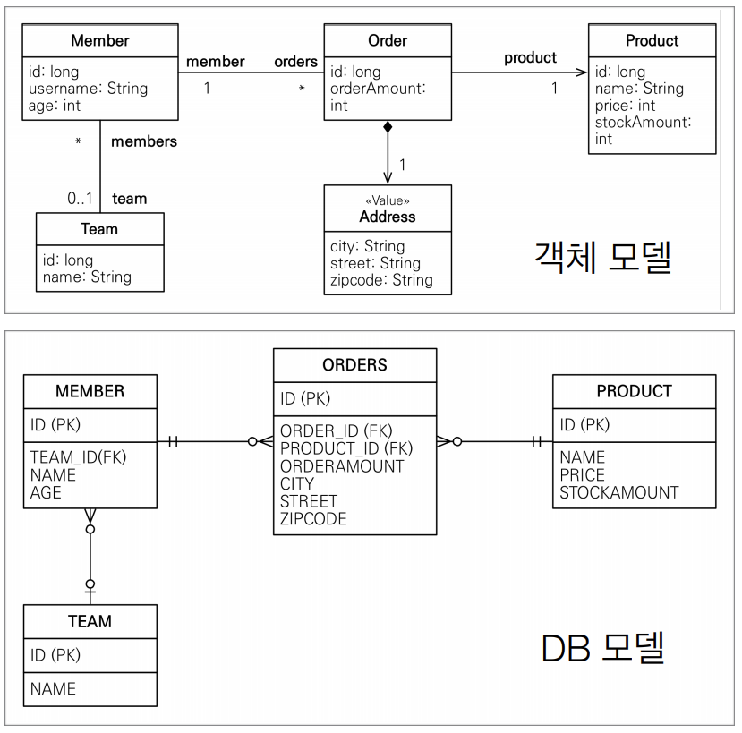
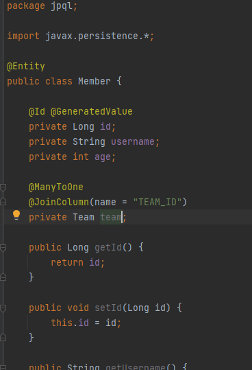
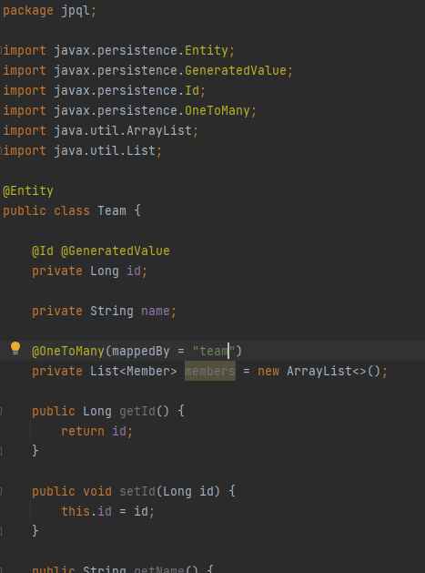
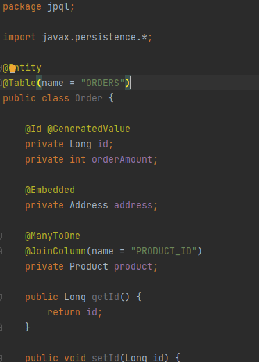
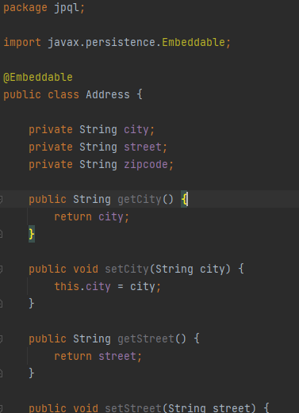
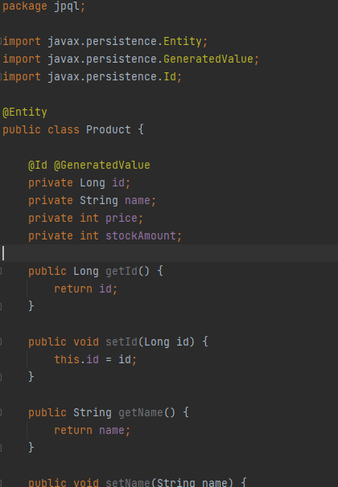

### 테이블















### TypeQuery, Query

* TypeQuery : 반환 타입이 명확할 때
* Query : 반환 타입이 명확하지 않을 때

```java
TypedQuery<Member> query1 = em.createQuery("select m from Member m", Member.class);
TypedQuery<String> query2 = em.createQuery("select m.username from Member m", String.class);
Query query3 = em.createQuery("select m.username, m.age from Member m"); // string, int
```


### 결과 조회 API

getResultList() : 결과가 하나 이상일 때, 리스트 반환

```java
TypedQuery<Member> query1 = em.createQuery("select m from Member m", Member.class);
List<Member> resultList = query1.getResultList();
```


getSingleResult() : 결과가 정확히 하나

```java
TypedQuery<Member> query1 = em.createQuery("select m from Member m", Member.class);
Member result = query1.getSingleResult();

```


