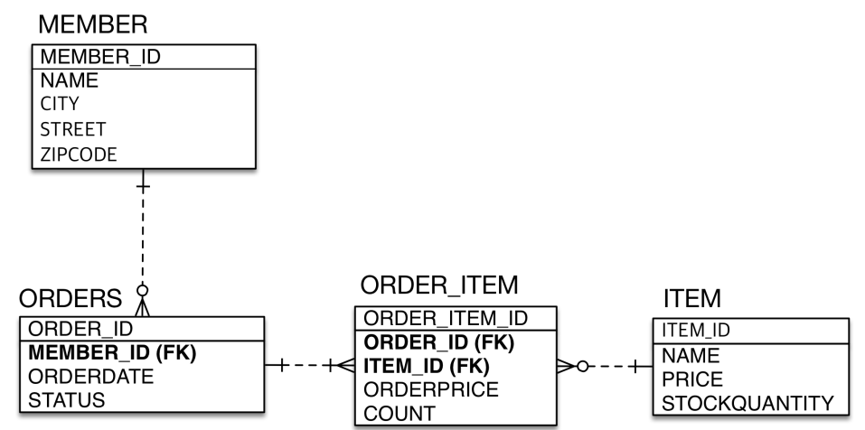

* Member.java

```java
package jpabook.jpashop.domain;

import javax.persistence.*;
import java.util.ArrayList;
import java.util.List;

@Entity
public class Member {

    @Id @GeneratedValue
    @Column(name = "MEMBER_ID")
    private Long id;
    private String name;
    private String city;
    private String street;
    private String zipcode;

    @OneToMany(mappedBy = "member")
    private List<Order> orders = new ArrayList<>();

    public Long getId() {
        return id;
    }

    public void setId(Long id) {
        this.id = id;
    }

    public String getName() {
        return name;
    }

    public void setName(String name) {
        this.name = name;
    }

    public String getCity() {
        return city;
    }

    public void setCity(String city) {
        this.city = city;
    }

    public String getStreet() {
        return street;
    }

    public void setStreet(String street) {
        this.street = street;
    }

    public String getZipcode() {
        return zipcode;
    }

    public void setZipcode(String zipcode) {
        this.zipcode = zipcode;
    }
}

```


* Order.java

```java
package jpabook.jpashop.domain;

import javax.persistence.*;
import java.time.LocalDateTime;
import java.util.ArrayList;
import java.util.List;

@Entity
@Table(name = "ORDERS")
public class Order {

    @Id @GeneratedValue
    @Column(name = "ORDER_ID")
    private Long id;

//    @Column(name = "MEMBER_ID")
//    private Long memberId;

    @ManyToOne
    @JoinColumn(name = "MEMBER_ID")
    private Member member;

    @OneToMany(mappedBy = "order")
    private List<OrderItem> orderItems = new ArrayList<>();

    private LocalDateTime orderDate;

    @Enumerated(EnumType.STRING)
    private OrderStatus status;

    public void addOrderItem(OrderItem orderItem) {
        orderItems.add(orderItem);
        orderItem.setOrder(this);
    }

    public Long getId() {
        return id;
    }

    public void setId(Long id) {
        this.id = id;
    }

    public Member getMember() {
        return member;
    }

    public void setMember(Member member) {
        this.member = member;
    }

    public LocalDateTime getOrderDate() {
        return orderDate;
    }

    public void setOrderDate(LocalDateTime orderDate) {
        this.orderDate = orderDate;
    }

    public OrderStatus getStatus() {
        return status;
    }

    public void setStatus(OrderStatus status) {
        this.status = status;
    }


}
```


* OrderItem.java

```java
package jpabook.jpashop.domain;

import javax.persistence.*;

@Entity
public class OrderItem {

    @Id @GeneratedValue
    @Column(name = "ORDER_ITEM_ID")
    private Long id;

//    @Column(name = "ORDER_ID")
//    private Long orderId;

    @ManyToOne
    @JoinColumn(name = "ORDER_ID")
    private Order order;

//    @Column(name = "ITEM_ID")
//    private Long itemId;

    @ManyToOne
    @JoinColumn(name = "ITEM_ID")
    private Item item;

    private int orderPrice;
    private int count;

    public Long getId() {
        return id;
    }

    public void setId(Long id) {
        this.id = id;
    }

    public Order getOrder() {
        return order;
    }

    public void setOrder(Order order) {
        this.order = order;
    }

    public Item getItem() {
        return item;
    }

    public void setItem(Item item) {
        this.item = item;
    }

    public int getOrderPrice() {
        return orderPrice;
    }

    public void setOrderPrice(int orderPrice) {
        this.orderPrice = orderPrice;
    }

    public int getCount() {
        return count;
    }

    public void setCount(int count) {
        this.count = count;
    }
}

```


* Item.java

```java
package jpabook.jpashop.domain;

import javax.persistence.Column;
import javax.persistence.Entity;
import javax.persistence.GeneratedValue;
import javax.persistence.Id;

@Entity
public class Item {

    @Id @GeneratedValue
    @Column(name = "ITEM_ID")
    private Long id;

    private String name;
    private int price;
    private int stockQuantity;

    public Long getId() {
        return id;
    }

    public void setId(Long id) {
        this.id = id;
    }

    public String getName() {
        return name;
    }

    public void setName(String name) {
        this.name = name;
    }

    public int getPrice() {
        return price;
    }

    public void setPrice(int price) {
        this.price = price;
    }

    public int getStockQuantity() {
        return stockQuantity;
    }

    public void setStockQuantity(int stockQuantity) {
        this.stockQuantity = stockQuantity;
    }
}

```


* JpaMain.java

```java
package jpabook.jpashop;

import jpabook.jpashop.domain.Order;
import jpabook.jpashop.domain.OrderItem;

import javax.persistence.EntityManager;
import javax.persistence.EntityManagerFactory;
import javax.persistence.EntityTransaction;
import javax.persistence.Persistence;

public class JpaMain {

    public static void main(String[] args) {
        EntityManagerFactory emf = Persistence.createEntityManagerFactory("hello");

        EntityManager em = emf.createEntityManager();

        EntityTransaction tx = em.getTransaction();

        tx.begin();

        try {
            Order order = new Order();
            order.addOrderItem(new OrderItem());

            tx.commit();
        } catch (Exception e) {
            tx.rollback();
        } finally {
            em.close();
        }

        emf.close();
    }
}

```

